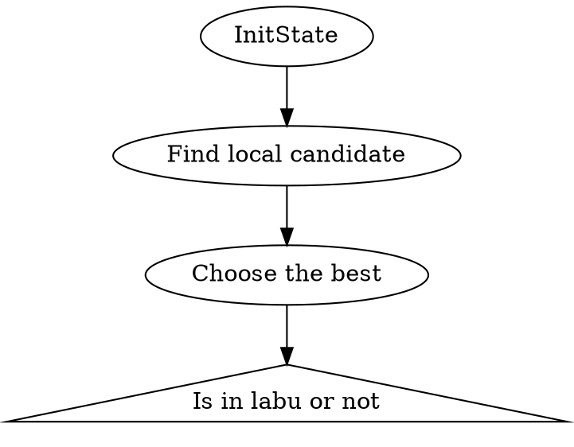

# Tabu Search 

Tabu Search 又稱禁忌演算法，是從狀態解去尋找最佳解的一個啟發式演算法。比起爬山演算法或單純的區域搜尋最佳解演算法，禁忌演算法使用一個禁忌項避免每次解都卡在區域解的狀態內。

首先我們介紹幾個專有名詞:
Operation 運算元: 當我們初始化一個解時，我們如何通過運算得到他周圍的鄰居就是運算元的定義。值得一提的是我們的運算元是要可以到達所有可能解集的所有狀態的，若無法則不是一個合法的 operation。

Tabu: 我們的禁忌解區，意思是我們禁止該區的鄰居成為目前的解。 
Configuration: 我們的解答所代表問題的意義，比如我們的configuration可用 list 、 bit array 來表示0/1背包問題裡面是否有放該物品，並且只有唯一一種表示法。

現在我們可以試圖來解決 0/1背包問題:

